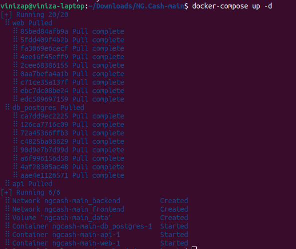
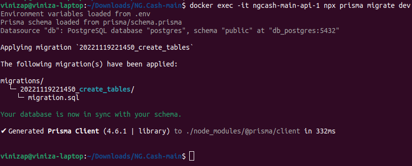

# NG.Cash

Para poder rodar o projeto será necessario ter o `nodejs` e `docker` instalado na maquina.

Ao clonar o projeto será necessario instalar as dependencias tanto do **Backend** quanto do **Frontend** dando `npm i` tanto na pasta **_"backend"_** quanto na **_"frontend"_**.

também será necessario criar o arquivo .env do backend com duas variáveis `DATABASE_URL` que representa a *URL* do banco de dados e `SECRET` sendo a chave do *token*

``` env
# URL já com os valores que foram setados pela docker
DATABASE_URL="postgresql://postgresUser:postgresPassword@db_postgres:5432/postgres?schema=public"

# chave token
SECRET = 8cf6fa6cb314ba11a28d9f5a8b7436cd
```

Após isso será necessario iniciar os containers. Eu criei um arquivo [`docker-compose`](./docker-compose.yml), startando ele o docker irá instalar e iniciar todoso os containers necessarios.

execuntado na raiz do projeto:

```shell
docker-compose up -d

```



Feito isso será necessario executar as *migrates* que foram feitas, para criar as tabelas no banco de dados, para esse projeto eu optei por usar o **_Prisma_** como *ORM* sendo assim poderá ser executado o compando `npx prisma migrate dev` no docker do **backend** que eu chamei de **api**, é possivel ver os containers que estão sendo executado com o seguinte comando `docker ps`


pegando o nome ou o id dos containers é possível executar o comando para executar as migrates

```shell
#docker exec -it <nome da docker ou sua ID> npx prisma migrate dev
docker exec -it ngcash-main-api-1 npx prisma migrate dev

```


Feito isso já é possivel abrir o projeto

- O **backend** estará executando na porta **3333**.
- O **frontend** estará executando na porta **5173**.

---

> Lembrando que as validações acontecem tanto no servidor quanto no lado do cliente
---

para o **login** e o **cadastro** eu criei um sistema inteligete que pega o valor do usuário e **verifica** na api se o **usuário tiver na pagina de login e o valor do usuário não existe ele abilita um botão de atalho para ir para a pagina de cadastro já preenchendo o valor do usuário apresentado** e caso estiver **na de cadastro gererá o mesmo atalho para o login se o valor do usuário já existe**.


---

Os valores da conta dos usuário são checados a cada 1 segundo e atualizado caso o usuário estiver logado com um token respectivo do seu usuário. 
E para as transições se é checado o valor do usuário antes de abilitar para enviar o valor para o usuário, possuindo todas as validações solicitados.


---

